# Análisis y diseño: inventario de ferretería

**Estado:** versión 1.0 (13-oct-2026), alineada con los requisitos finales y con el código de `inventario-ferreteria`.
**Entradas:** [01-requisitos.md](01-requisitos.md) (requisitos RF/RNF, matriz de permisos de la sección 5 y reglas RN-01 a RN-16), el esquema `src/main/resources/db/migration/V1__esquema_inventario.sql`, los datos base `V2__datos_base.sql`, el código Java del paquete `co.ferreteria.inventario` y la interfaz web en `frontend/` (React).

---

## 1. Introducción y alcance del análisis

Este documento describe **qué hace el sistema y cómo está construido**: casos de uso, modelo de dominio, clases de la aplicación, interacciones, estados de los objetos de negocio, contrato de la API REST e interfaz de usuario. Todo lo que aquí se describe existe en el código; cuando el código no cubre todo un requisito, se indica de forma explícita (sección 11).

El alcance es el de los requisitos finales: una ferretería con **una sola bodega**, cuyas existencias solo cambian por **compras** (documento de ingreso `ING-n`) y **ventas** (factura `FE-n`, o el prefijo del equipo cuando se vende sin internet). Las reservas y los daños son **cambios de estado** dentro de la bodega (disponible, reservada, dañada) que no alteran el total. Quedan fuera los ajustes, el conteo físico, los traslados y las devoluciones (sección 6 de los requisitos).

Arquitectura en una línea: aplicación Spring Boot 3.5 (Java 21) con API REST protegida por JWT, PostgreSQL 16 con las reglas críticas en disparadores, e interfaz web PWA en React con íconos Font Awesome que puede facturar sin conexión.

---

## 2. Modelo de casos de uso

### 2.1 Actores

| Actor | Rol en el sistema (`rol.codigo`) | Descripción |
|---|---|---|
| Vendedor | `VENTAS` | Factura en mostrador con lector, reserva para clientes y registra clientes. |
| Compras | `COMPRAS` | Registra proveedores y compras con documento de ingreso. |
| Responsable de inventario | `INVENTARIO` | Catálogo, conversiones, dañados, reservas, kárdex y cierre mensual. |
| Gerencia | `GERENCIA` | Precios, anulaciones, reapertura de cierres, auditoría y reportes. |
| Administrador | `ADMIN` | Tiene todos los permisos; además usuarios, migración e integraciones. |
| Sistema externo | — | Recibe por HTTP los eventos de la bandeja de salida (facturación electrónica, contabilidad). |
| Proceso programado | usuario técnico id 1 | Tareas `@Scheduled`: cierre mensual, liberación de reservas, envío de eventos y particiones. |

### 2.2 Diagrama de casos de uso

El Administrador puede ejecutar todos los casos de uso; en el diagrama solo se dibujan los que son exclusivos de su rol.

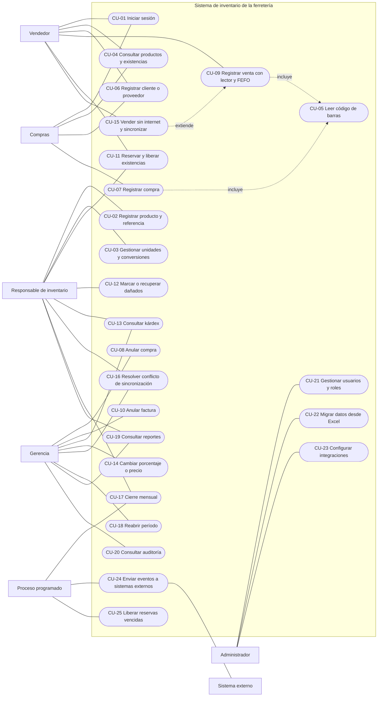
```mermaid
flowchart LR
    VEN["Vendedor"]
    COM["Compras"]
    INV["Responsable de inventario"]
    GER["Gerencia"]
    ADM["Administrador"]
    EXT["Sistema externo"]
    PRG["Proceso programado"]

    subgraph SIS["Sistema de inventario de la ferretería"]
        UC01(["CU-01 Iniciar sesión"])
        UC02(["CU-02 Registrar producto y referencia"])
        UC03(["CU-03 Gestionar unidades y conversiones"])
        UC04(["CU-04 Consultar productos y existencias"])
        UC05(["CU-05 Leer código de barras"])
        UC06(["CU-06 Registrar cliente o proveedor"])
        UC07(["CU-07 Registrar compra"])
        UC08(["CU-08 Anular compra"])
        UC09(["CU-09 Registrar venta con lector y FEFO"])
        UC10(["CU-10 Anular factura"])
        UC11(["CU-11 Reservar y liberar existencias"])
        UC12(["CU-12 Marcar o recuperar dañados"])
        UC13(["CU-13 Consultar kárdex"])
        UC14(["CU-14 Cambiar porcentaje o precio"])
        UC15(["CU-15 Vender sin internet y sincronizar"])
        UC16(["CU-16 Resolver conflicto de sincronización"])
        UC17(["CU-17 Cierre mensual"])
        UC18(["CU-18 Reabrir período"])
        UC19(["CU-19 Consultar reportes"])
        UC20(["CU-20 Consultar auditoría"])
        UC21(["CU-21 Gestionar usuarios y roles"])
        UC22(["CU-22 Migrar datos desde Excel"])
        UC23(["CU-23 Configurar integraciones"])
        UC24(["CU-24 Enviar eventos a sistemas externos"])
        UC25(["CU-25 Liberar reservas vencidas"])
    end

    VEN --- UC01 & UC04 & UC06 & UC09 & UC11 & UC15
    COM --- UC01 & UC04 & UC06 & UC07
    INV --- UC02 & UC03 & UC11 & UC12 & UC13 & UC16 & UC17 & UC19
    GER --- UC08 & UC10 & UC13 & UC14 & UC16 & UC18 & UC19 & UC20
    ADM --- UC21 & UC22 & UC23
    PRG --- UC17 & UC24 & UC25
    UC24 --- EXT
    UC09 -.->|incluye| UC05
    UC07 -.->|incluye| UC05
    UC15 -.->|extiende| UC09
```

### 2.3 Trazabilidad caso de uso → requisito → API → permiso

| Caso de uso | Actor principal | RF | Endpoint(s) REST | Permiso |
|---|---|---|---|---|
| CU-01 Iniciar sesión | Todos | RF-SEG-001 | `POST /api/auth/login` | público |
| CU-02 Registrar producto y referencia | Inventario | RF-PRO-001 | `POST /api/productos`, `POST /api/productos/{id}/referencias`, `POST /api/categorias`, `POST /api/marcas` | `PRODUCTO_EDITAR` |
| CU-03 Unidades y conversiones | Inventario | RF-PRO-003 | `POST /api/referencias/{id}/conversiones` | `PRODUCTO_EDITAR` |
| CU-04 Consultar productos y existencias | Todos | RF-PRO-002, RF-ALR-001 | `GET /api/referencias`, `GET /api/referencias/{id}`, `GET /api/lotes/por-vencer`, `GET /api/catalogo/maestros` | autenticado (costos con `COSTO_VER`) |
| CU-05 Leer código de barras | Vendedor, Compras | RF-LEC-001 | `GET /api/referencias/codigo/{codigo}` | autenticado |
| CU-06 Registrar cliente o proveedor | Vendedor, Compras | RF-TER-001 | `POST /api/terceros`, `PUT /api/terceros/{id}`, `GET /api/terceros` | `TERCERO_EDITAR` (consulta: autenticado) |
| CU-07 Registrar compra | Compras | RF-COM-001, RF-PRE-001 | `POST /api/compras`, `GET /api/compras`, `GET /api/compras/{id}` | `COMPRA_REGISTRAR` |
| CU-08 Anular compra | Gerencia | RF-COM-001 | `POST /api/compras/{id}/anular` | `COMPRA_ANULAR` |
| CU-09 Registrar venta | Vendedor | RF-VEN-001, RF-LEC-001 | `POST /api/ventas`, `GET /api/ventas`, `GET /api/ventas/{id}` | `VENTA_EMITIR` |
| CU-10 Anular factura | Gerencia | RF-VEN-001 | `POST /api/ventas/{id}/anular` | `VENTA_ANULAR` |
| CU-11 Reservar y liberar | Vendedor, Inventario | RF-EST-001 | `POST /api/reservas`, `POST /api/reservas/{id}/liberar`, `GET /api/reservas` | `RESERVA_GESTIONAR` |
| CU-12 Marcar o recuperar dañados | Inventario | RF-EST-001 | `POST /api/existencias/cambios-estado` | `ESTADO_DANADO` |
| CU-13 Consultar kárdex | Inventario, Gerencia | RF-MOV-003 | `GET /api/kardex` | `PRODUCTO_EDITAR` o `REPORTE_CONSULTAR` |
| CU-14 Cambiar porcentaje o precio | Gerencia | RF-PRE-001 | `PUT /api/referencias/{id}/precio/porcentaje`, `PUT /api/referencias/{id}/precio/manual`, `GET .../precio/historial` | `PRECIO_CAMBIAR` |
| CU-15 Vender sin internet y sincronizar | Vendedor | RF-OFF-001 | `GET /api/sync/catalogo`, `GET /api/sync/dispositivos`, `POST /api/sync/dispositivos/{id}/bloque`, `POST /api/sync/ventas` | `VENTA_EMITIR` |
| CU-16 Resolver conflicto | Inventario, Gerencia | RF-OFF-001 | `GET /api/sync/conflictos`, `POST /api/sync/conflictos/{uuid}/resolver` | `PRODUCTO_EDITAR` o `VENTA_ANULAR` |
| CU-17 Cierre mensual | Proceso programado, Inventario | RF-CIE-001 | `POST /api/periodos/{periodo}/cerrar`, `GET /api/periodos`, `GET /api/periodos/{periodo}/saldos` | `CIERRE_EJECUTAR` |
| CU-18 Reabrir período | Gerencia | RF-CIE-001 | `POST /api/periodos/{periodo}/reabrir` | `CIERRE_REABRIR` |
| CU-19 Consultar reportes | Inventario, Gerencia | RF-REP-001 | `GET /api/reportes/ventas-diarias`, `/margen`, `/valoracion`, `/garantias-vigentes` | `REPORTE_CONSULTAR` (+ `COSTO_VER` en margen y valoración) |
| CU-20 Consultar auditoría | Gerencia | RF-AUD-001 | `GET /api/auditoria` | `AUDITORIA_CONSULTAR` |
| CU-21 Usuarios y roles | Administrador | RF-SEG-001 | `GET/POST /api/usuarios`, `PUT /api/usuarios/{id}`, `GET /api/usuarios/roles` | `USUARIO_ADMINISTRAR` |
| CU-22 Migrar desde Excel | Administrador | RF-MIG-001 | `GET /api/migracion/plantilla`, `POST /api/migracion`, `POST /api/migracion/{id}/cargar`, `GET /api/migracion/{id}` | `MIGRACION_EJECUTAR` |
| CU-23 Configurar integraciones | Administrador | RF-INT-001 | `GET/POST /api/integracion/sistemas`, `GET /api/integracion/eventos`, `POST /api/integracion/eventos/{id}/reintentar` | `USUARIO_ADMINISTRAR` |
| CU-24 Enviar eventos | Proceso programado | RF-INT-001 | `DespachadorEventos.despachar()` (sin endpoint) | — |
| CU-25 Liberar reservas vencidas | Proceso programado | RF-EST-001 | `TareasInventario.liberarReservasVencidas()` (sin endpoint) | — |

La asignación de permisos a roles está en `V2__datos_base.sql` y coincide con la matriz de la sección 5 de los requisitos.

---

## 3. Especificación de los casos de uso clave

### 3.1 CU-07 Registrar compra (RF-COM-001)

| Elemento | Contenido |
|---|---|
| Actor | Compras (permiso `COMPRA_REGISTRAR`). |
| Precondiciones | Proveedor activo con `es_proveedor`; referencias activas con la unidad habilitada para compra; rango `ING` vigente en `consecutivo`; mes de la fecha efectiva abierto. |
| Postcondiciones | Compra `CONFIRMADA` con número `ING-n`; un movimiento `ENTRADA_COMPRA` por línea en estado `DISPONIBLE`; costo promedio, último costo y precio actualizados; evento `COMPRA_CONFIRMADA` en la bandeja de salida; auditoría de cada fila insertada. |

**Flujo principal**
1. El actor abre «Comprar», elige el proveedor e introduce número y fecha de la factura del proveedor.
2. Escanea o digita cada código; la interfaz consulta `GET /api/referencias/codigo/{codigo}` y agrega la línea con unidad, cantidad, costo unitario sin IVA y, si el producto controla vencimiento, lote y fecha de vencimiento.
3. Al confirmar, la interfaz envía `POST /api/compras` con un `uuid` generado en el navegador.
4. `CompraService.registrar` verifica que el `uuid` no exista, valida el proveedor y toma el siguiente número con `Consecutivos.siguiente("INGRESO")`.
5. Por cada línea: obtiene datos y factor de la unidad (`InfoReferencias.info` y `unidad`), busca o crea el lote (`loteParaCompra`), inserta `compra_detalle` y registra la entrada con `Kardex.registrar(Movimiento.entradaCompra(...))`, en unidad base y con costo por unidad base.
6. El disparador `fn_aplicar_movimiento` valida el período, suma a `existencia` y recalcula el costo promedio ponderado y el último costo.
7. El servicio guarda subtotal, IVA y total; llama `fn_actualizar_precio(ref, 'COMPRA', usuario)` por cada referencia comprada y registra el evento `COMPRA_CONFIRMADA`.
8. El sistema responde 201 con id, documento, subtotal, impuestos y total.

**Flujos alternos y excepciones**
- A1. Reintento con el mismo `uuid` (por ejemplo, la red cortó la respuesta): se devuelve el resultado ya registrado, sin duplicar.
- E1. Proveedor inexistente: 404. Tercero que no es proveedor activo: 422.
- E2. Referencia inactiva o unidad no habilitada para compra: 422.
- E3. Producto con vencimiento sin lote o sin fecha, o lote existente con otra fecha: 422.
- E4. Factura de proveedor repetida para el mismo proveedor (`UNIQUE (proveedor_id, numero_factura_proveedor)`): 409.
- E5. Fecha efectiva en un mes `CERRADO` o `EN_CIERRE`: el disparador lanza excepción y responde 422.
- E6. Sin rango de numeración vigente: 422.
- En todos los casos la transacción se revierte completa: no queda documento, movimiento ni evento (RNF-FIA-001).

### 3.2 CU-09 Registrar venta con lector y FEFO (RF-VEN-001)

| Elemento | Contenido |
|---|---|
| Actor | Vendedor (permiso `VENTA_EMITIR`). |
| Precondiciones | Cliente activo o «Consumidor final» (CC 222222222222); rango `FE` vigente; mes abierto; referencias con precio de venta. |
| Postcondiciones | Venta `EMITIDA` con número `FE-n` y `estado_envio_fe = PENDIENTE`; una `SALIDA_VENTA` por línea; costo de venta y fecha de fin de garantía guardados en cada línea; evento `VENTA_EMITIDA`. |

**Flujo principal**
1. El vendedor abre «Vender», busca el cliente (vacío = consumidor final) y elige contado o crédito.
2. Escanea cada código: el lector escribe el código y Enter; un texto de 8 a 14 dígitos se busca por `GET /api/referencias/codigo/{codigo}`, cualquier otro texto por nombre.
3. La interfaz trae las unidades de venta (`GET /api/referencias/{id}`), propone la unidad base, calcula precio por unidad (precio base × factor), subtotal e IVA.
4. Al confirmar se envía `POST /api/ventas` con `uuid`, cliente, forma de pago y líneas.
5. `VentaService.emitir` revisa idempotencia, toma `Consecutivos.siguiente("FACTURA")` y crea la venta.
6. Por cada línea: convierte a unidad base, exige múltiplo de la fracción mínima, verifica que el precio sea el vigente (o que el usuario tenga `PRECIO_CAMBIAR`), y elige el origen:
   - con `reservaId`: consume la reserva del mismo cliente y sale de `RESERVADA`;
   - con producto que vence y sin lote: `InfoReferencias.loteFefo` elige el lote vigente que vence primero con saldo suficiente;
   - en otro caso: sale de `DISPONIBLE`.
7. Calcula la fecha de fin de garantía (fecha de factura + meses de garantía), inserta `venta_detalle` y registra la salida en el kárdex; el disparador valida período, lote no vencido y saldo, y devuelve el costo promedio, que se guarda como `costo_unitario_base` de la línea.
8. Guarda totales, registra `VENTA_EMITIDA` y responde 201; la interfaz muestra el enlace a la factura para imprimir.

**Flujos alternos y excepciones**
- A1. Mismo `uuid`: devuelve la factura ya emitida.
- A2. Sin conexión al confirmar: continúa en CU-15.
- A3. Código desconocido: la interfaz informa «No se encontró la referencia» y no modifica la venta.
- E1. Saldo insuficiente en el estado de origen: el disparador lanza `check_violation` y responde **409** con referencia, lote y cantidad pedida.
- E2. Producto con vencimiento sin lote vigente con saldo suficiente: 422 desde `loteFefo`.
- E3. Lote vencido indicado a mano o mes cerrado: 422 desde el disparador.
- E4. Cantidad que no es múltiplo de la fracción mínima, precio o descuento sin permiso, referencia sin precio, descuento mayor que la línea, reserva de otro cliente o con otra cantidad: 422.
- E5. Venta de existencias dañadas: imposible; `ck_mov_no_vender_danado` solo admite origen `DISPONIBLE` o `RESERVADA`.

### 3.3 CU-15 Vender sin internet y sincronizar (RF-OFF-001)

| Elemento | Contenido |
|---|---|
| Actor | Vendedor; servicio de sincronización. |
| Precondiciones | Equipo registrado en `dispositivo` con `permite_fuera_linea`; rango `FACTURA` propio del equipo en `consecutivo`; catálogo local y bloque de números obtenidos mientras había conexión. |
| Postcondiciones | Cada venta queda una sola vez en `operacion_fuera_linea` como `APLICADA` (con su venta y movimientos, origen `FUERA_DE_LINEA`) o como `CONFLICTO` (sin movimientos). |

**Flujo principal**
1. Con conexión, en la pantalla «Sin internet», el vendedor elige el equipo, pide un bloque (`POST /api/sync/dispositivos/{id}/bloque?cantidad=50`) y actualiza el catálogo local (`GET /api/sync/catalogo`).
2. Sin conexión, la venta se arma igual que en CU-09 con la búsqueda local; al confirmar, `fetch` falla y `venderSinConexion` valida el saldo disponible de la copia local, toma el siguiente número del bloque, genera el `uuid`, descuenta la copia local y guarda la operación en la cola de `localStorage`.
3. La interfaz muestra el número de factura del equipo y el contador de ventas pendientes.
4. Al volver la conexión (evento `online` o cada 60 s), `sincronizar` envía la cola a `POST /api/sync/ventas`.
5. Por cada operación, `SincronizacionController` consulta `yaProcesada(uuid)`; si es nueva, `SincronizacionService.aplicar` llama `VentaService.emitirFueraDeLinea` con origen `FUERA_DE_LINEA`, el número del equipo y la fecha local, en una transacción propia, y guarda la operación como `APLICADA`.
6. La interfaz quita de la cola las operaciones `APLICADA` o `CONFLICTO` y refresca el catálogo.

**Flujos alternos y excepciones**
- A1. Reenvío de una operación ya procesada: se devuelve su resultado anterior sin aplicarla de nuevo.
- E1. Otra caja vendió la última unidad, lote vencido, mes cerrado u otra regla: la transacción de la venta se revierte y `registrarConflicto` guarda la operación en `CONFLICTO` con el motivo; nunca hay saldo negativo.
- E2. Número de factura que no pertenece a un bloque entregado al equipo (`numeroEntregadoAlEquipo`): conflicto.
- E3. Equipo no autorizado o sin rango disponible al pedir bloque: 422.
- E4. Sin bloque o sin saldo local: la interfaz no guarda la venta y muestra el motivo.
- A2. Un responsable revisa los conflictos (CU-16) y los resuelve con `POST /api/sync/conflictos/{uuid}/resolver`, que deja la operación `RECHAZADA` con usuario, fecha y resolución.

### 3.4 CU-17 Cierre mensual (RF-CIE-001)

| Elemento | Contenido |
|---|---|
| Actores | Proceso programado (`TareasCierre`); Responsable de inventario (`CIERRE_EJECUTAR`) para ejecución manual; Gerencia (`CIERRE_REABRIR`) para reapertura. |
| Precondiciones | Mes ya terminado, en estado `ABIERTO` o `REABIERTO`; sin operaciones sin internet `RECIBIDA` o `CONFLICTO` de ese mes o anteriores. |
| Postcondiciones | Período `CERRADO` con `cerrado_en` y `cerrado_por`; fotografía en `cierre_saldo` por referencia, lote y estado con costo promedio y valor; evento `CIERRE` en auditoría. |

**Flujo principal**
1. El día 1 de cada mes a las 02:00, hora de Colombia (`app.cierre.cron = 0 0 2 1 * *`, zona `America/Bogota`), `TareasCierre.cierreProgramado` calcula el período del mes anterior (AAAAMM).
2. Ejecuta con la identidad del usuario técnico (`ComoSistema`), crea las particiones futuras (`fn_crear_particiones`) y llama `CierreService.cerrar(periodo)`.
3. `CierreService` comprueba que el mes ya terminó, asegura que el período exista (`fn_asegurar_periodo`) y llama `fn_cerrar_periodo(periodo, usuario)`.
4. La función pasa el período a `EN_CIERRE`, verifica que no haya operaciones sin internet pendientes, borra una fotografía anterior (recierre), calcula el saldo al cierre como saldo actual menos los movimientos de períodos posteriores, toma el costo promedio vigente al final del mes e inserta `cierre_saldo`.
5. Marca el período `CERRADO` y registra la auditoría `CIERRE` con el número de saldos.
6. Desde ese momento `fn_aplicar_movimiento` rechaza cualquier movimiento con fecha efectiva en ese mes.

**Flujos alternos y excepciones**
- A1. Ejecución manual desde «Cierres mensuales» (`POST /api/periodos/{periodo}/cerrar`), que responde con la cantidad de saldos.
- A2. Reapertura: Gerencia indica el motivo (`POST /api/periodos/{periodo}/reabrir`); el período pasa a `REABIERTO` con usuario, fecha y motivo, y se audita como `REAPERTURA`. Al volver a cerrar se recalcula la fotografía.
- E1. Operaciones sin internet pendientes o en conflicto: la función lanza excepción, la transacción se revierte (el período vuelve a su estado anterior) y el cierre programado queda **aplazado** en el registro de la aplicación; se puede reintentar a mano.
- E2. Período en curso o futuro: 422 «Solo se cierran meses ya terminados».
- E3. Período que no está abierto (por ejemplo, ya cerrado): 422.

---

## 4. Modelo de dominio

El diagrama muestra las entidades principales y sus atributos clave tal como están en `V1__esquema_inventario.sql`. Cantidades en unidad base con 4 decimales; costos y precios por unidad base y sin IVA.

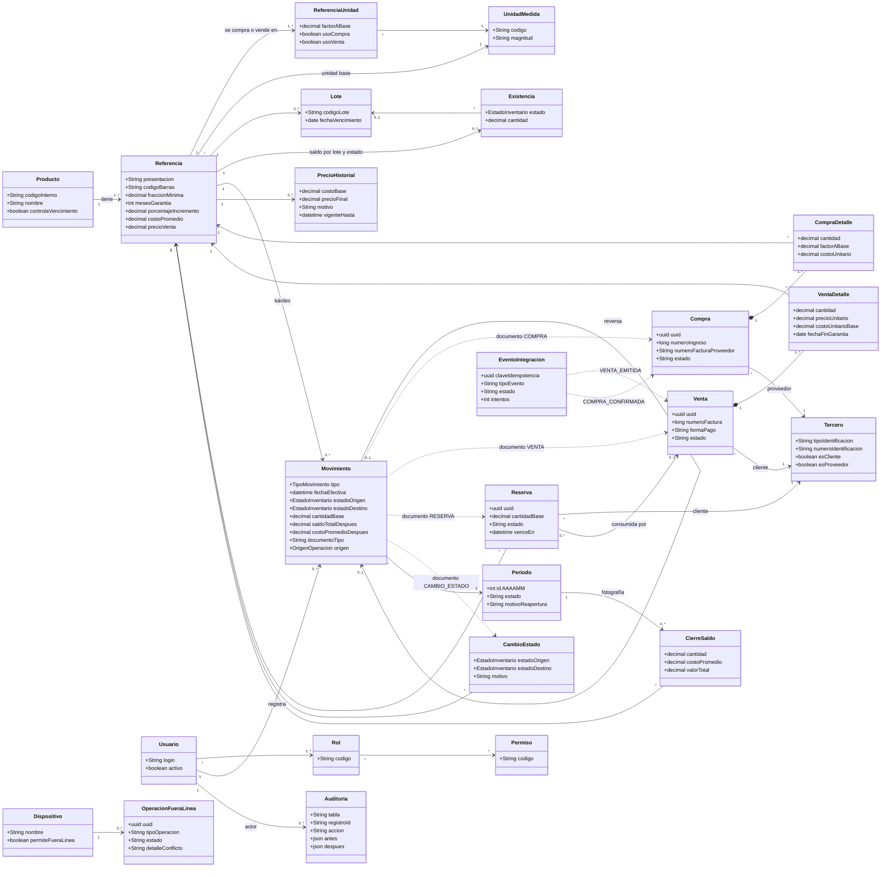
```mermaid
classDiagram
    direction LR
    class Producto {
        +String codigoInterno
        +String nombre
        +boolean controlaVencimiento
    }
    class Referencia {
        +String presentacion
        +String codigoBarras
        +decimal fraccionMinima
        +int mesesGarantia
        +decimal porcentajeIncremento
        +decimal costoPromedio
        +decimal precioVenta
    }
    class UnidadMedida {
        +String codigo
        +String magnitud
    }
    class ReferenciaUnidad {
        +decimal factorABase
        +boolean usoCompra
        +boolean usoVenta
    }
    class Lote {
        +String codigoLote
        +date fechaVencimiento
    }
    class Existencia {
        +EstadoInventario estado
        +decimal cantidad
    }
    class Movimiento {
        +TipoMovimiento tipo
        +datetime fechaEfectiva
        +EstadoInventario estadoOrigen
        +EstadoInventario estadoDestino
        +decimal cantidadBase
        +decimal saldoTotalDespues
        +decimal costoPromedioDespues
        +String documentoTipo
        +OrigenOperacion origen
    }
    class Compra {
        +uuid uuid
        +long numeroIngreso
        +String numeroFacturaProveedor
        +String estado
    }
    class CompraDetalle {
        +decimal cantidad
        +decimal factorABase
        +decimal costoUnitario
    }
    class Venta {
        +uuid uuid
        +long numeroFactura
        +String formaPago
        +String estado
    }
    class VentaDetalle {
        +decimal cantidad
        +decimal precioUnitario
        +decimal costoUnitarioBase
        +date fechaFinGarantia
    }
    class Reserva {
        +uuid uuid
        +decimal cantidadBase
        +String estado
        +datetime venceEn
    }
    class CambioEstado {
        +EstadoInventario estadoOrigen
        +EstadoInventario estadoDestino
        +String motivo
    }
    class Tercero {
        +String tipoIdentificacion
        +String numeroIdentificacion
        +boolean esCliente
        +boolean esProveedor
    }
    class Usuario {
        +String login
        +boolean activo
    }
    class Rol {
        +String codigo
    }
    class Permiso {
        +String codigo
    }
    class Periodo {
        +int id AAAAMM
        +String estado
        +String motivoReapertura
    }
    class CierreSaldo {
        +decimal cantidad
        +decimal costoPromedio
        +decimal valorTotal
    }
    class PrecioHistorial {
        +decimal costoBase
        +decimal precioFinal
        +String motivo
        +datetime vigenteHasta
    }
    class Dispositivo {
        +String nombre
        +boolean permiteFueraLinea
    }
    class OperacionFueraLinea {
        +uuid uuid
        +String tipoOperacion
        +String estado
        +String detalleConflicto
    }
    class EventoIntegracion {
        +uuid claveIdempotencia
        +String tipoEvento
        +String estado
        +int intentos
    }
    class Auditoria {
        +String tabla
        +String registroId
        +String accion
        +json antes
        +json despues
    }

    Producto "1" --> "1..*" Referencia : tiene
    Referencia "1" --> "1..*" ReferenciaUnidad : se compra o vende en
    ReferenciaUnidad "*" --> "1" UnidadMedida
    Referencia "*" --> "1" UnidadMedida : unidad base
    Referencia "1" --> "0..*" Lote
    Referencia "1" --> "0..*" Existencia : saldo por lote y estado
    Lote "0..1" <-- "*" Existencia
    Referencia "1" --> "0..*" Movimiento : kárdex
    Movimiento "0..1" --> "0..1" Movimiento : reversa
    Compra "1" *-- "1..*" CompraDetalle
    CompraDetalle "*" --> "1" Referencia
    Compra "*" --> "1" Tercero : proveedor
    Venta "1" *-- "1..*" VentaDetalle
    VentaDetalle "*" --> "1" Referencia
    Venta "*" --> "1" Tercero : cliente
    Reserva "*" --> "1" Tercero : cliente
    Reserva "*" --> "1" Referencia
    Reserva "0..*" --> "0..1" Venta : consumida por
    CambioEstado "*" --> "1" Referencia
    Movimiento ..> Compra : documento COMPRA
    Movimiento ..> Venta : documento VENTA
    Movimiento ..> Reserva : documento RESERVA
    Movimiento ..> CambioEstado : documento CAMBIO_ESTADO
    Movimiento "*" --> "1" Periodo
    Periodo "1" --> "0..*" CierreSaldo : fotografía
    CierreSaldo "*" --> "1" Referencia
    Referencia "1" --> "0..*" PrecioHistorial
    Usuario "*" --> "1..*" Rol
    Rol "*" --> "*" Permiso
    Dispositivo "1" --> "0..*" OperacionFueraLinea
    Usuario "1" --> "0..*" Movimiento : registra
    Usuario "1" --> "0..*" Auditoria : actor
    EventoIntegracion ..> Venta : VENTA_EMITIDA
    EventoIntegracion ..> Compra : COMPRA_CONFIRMADA
```

Notas de dominio:
- **Producto / Referencia**: el producto es lo que pide el cliente («cable THHN 12»); la referencia es producto + marca + presentación, con un solo código de barras único (RN-01). Marca, categoría y tarifa de IVA son maestros simples que no se dibujan.
- **Existencia** es una proyección del kárdex: una fila por referencia + lote + estado con `CHECK (cantidad >= 0)`. Solo la modifica el disparador al insertar un `Movimiento`.
- **Movimiento** referencia su documento de forma polimórfica (`documento_tipo`, `documento_id`, `documento_detalle_id`); `ck_mov_estados_segun_tipo` fija qué estados lleva cada tipo.
- **Consecutivo** (no dibujado) guarda los rangos `INGRESO` y `FACTURA`; con `dispositivo_id` nulo es el rango del servidor, con valor es el rango del equipo para operar sin internet.
- **Importacion / ImportacionFila** (no dibujadas) son el área de preparación de la migración; **SistemaExterno** y **MapeoExterno** soportan la integración.

---

## 5. Diseño de componentes (clases de la aplicación)

Cada módulo de negocio es un paquete con controlador delgado, servicio `@Transactional` y SQL con `JdbcClient`. Los maestros (usuario, rol, producto, referencia, tercero) usan JPA. El diagrama muestra las clases que intervienen en la venta y la compra.

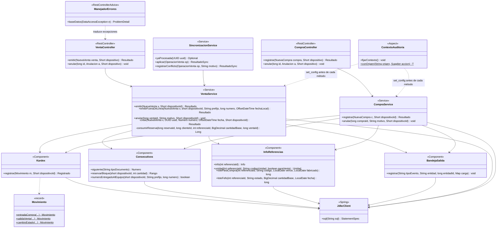
```mermaid
classDiagram
    direction TB
    class VentaController {
        <<RestController>>
        +emitir(NuevaVenta venta, Short dispositivo) Resultado
        +anular(long id, Anulacion a, Short dispositivo) void
    }
    class CompraController {
        <<RestController>>
        +registrar(NuevaCompra compra, Short dispositivo) Resultado
        +anular(long id, Anulacion a, Short dispositivo) void
    }
    class SincronizacionService {
        <<Service>>
        +yaProcesada(UUID uuid) Optional
        +aplicar(OperacionVenta op) ResultadoSync
        +registrarConflicto(OperacionVenta op, String motivo) ResultadoSync
    }
    class VentaService {
        <<Service>>
        +emitir(NuevaVenta v, Short dispositivoId) Resultado
        +emitirFueraDeLinea(NuevaVenta v, short dispositivoId, String prefijo, long numero, OffsetDateTime fechaLocal) Resultado
        +anular(long ventaId, String motivo, Short dispositivoId) void
        -crear(NuevaVenta v, UUID uuid, Numero numero, OffsetDateTime fecha, Short dispositivoId) Resultado
        -consumirReserva(long reservaId, long clienteId, int referenciaId, BigDecimal cantidadBase, long ventaId) Long
    }
    class CompraService {
        <<Service>>
        +registrar(NuevaCompra c, Short dispositivoId) Resultado
        +anular(long compraId, String motivo, Short dispositivoId) void
    }
    class Kardex {
        <<Component>>
        +registrar(Movimiento m, Short dispositivoId) Registrado
    }
    class Movimiento {
        <<record>>
        +entradaCompra(...)$ Movimiento
        +salidaVenta(...)$ Movimiento
        +cambioEstado(...)$ Movimiento
    }
    class Consecutivos {
        <<Component>>
        +siguiente(String tipoDocumento) Numero
        +reservarBloque(short dispositivoId, int cantidad) Rango
        +numeroEntregadoAlEquipo(short dispositivoId, String prefijo, long numero) boolean
    }
    class InfoReferencias {
        <<Component>>
        +info(int referenciaId) Info
        +unidad(int referenciaId, String codigoUnidad, boolean paraVenta) Unidad
        +loteParaCompra(int referenciaId, String codigo, LocalDate vence, LocalDate fabricado) long
        +loteFefo(int referenciaId, String estado, BigDecimal cantidadBase, LocalDate fecha) long
    }
    class BandejaSalida {
        <<Component>>
        +registrar(String tipoEvento, String entidad, long entidadId, Map carga) void
    }
    class ContextoAuditoria {
        <<Aspect>>
        +fijarContexto() void
        +conOrigen(String origen, Supplier accion)$ T
    }
    class ManejadorErrores {
        <<RestControllerAdvice>>
        +baseDatos(DataAccessException e) ProblemDetail
    }
    class JdbcClient {
        <<Spring>>
        +sql(String sql) StatementSpec
    }

    VentaController --> VentaService
    CompraController --> CompraService
    SincronizacionService --> VentaService
    VentaService --> Kardex
    VentaService --> Consecutivos
    VentaService --> InfoReferencias
    VentaService --> BandejaSalida
    CompraService --> Kardex
    CompraService --> Consecutivos
    CompraService --> InfoReferencias
    CompraService --> BandejaSalida
    Kardex ..> Movimiento
    Kardex --> JdbcClient
    Consecutivos --> JdbcClient
    InfoReferencias --> JdbcClient
    BandejaSalida --> JdbcClient
    VentaService --> JdbcClient
    CompraService --> JdbcClient
    ContextoAuditoria ..> VentaService : set_config antes de cada método
    ContextoAuditoria ..> CompraService : set_config antes de cada método
    ManejadorErrores ..> VentaController : traduce excepciones
```

Responsabilidades:
- **Kardex** es el único punto que escribe en `movimiento` (regla 4 de `CLAUDE.md`); nunca se hace `UPDATE existencia`.
- **Consecutivos** numera con un `UPDATE ... RETURNING` que bloquea la fila del rango: no hay números repetidos por concurrencia.
- **InfoReferencias** concentra la lectura de datos de venta y compra (IVA, fracción, garantía, precio) y la resolución de lotes (FEFO).
- **BandejaSalida** implementa el patrón outbox: inserta un `evento_integracion` por cada sistema externo activo, dentro de la misma transacción del documento. **DespachadorEventos** los envía después.
- **ContextoAuditoria** es un aspecto que, antes de cada método de un `@Service` con transacción activa, ejecuta `set_config('app.usuario_id' | 'app.dispositivo_id' | 'app.origen', ..., true)`; el disparador `fn_auditar` lee esos valores.

---

## 6. Diagramas de secuencia

### 6.1 Inicio de sesión con JWT

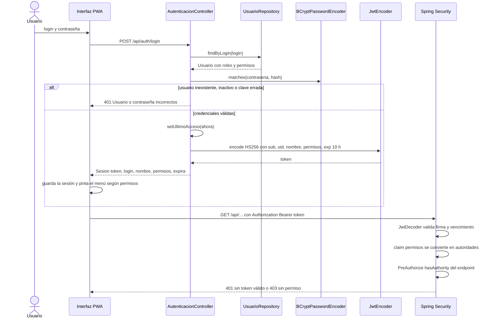
```mermaid
sequenceDiagram
    actor U as Usuario
    participant UI as Interfaz PWA
    participant AC as AutenticacionController
    participant UR as UsuarioRepository
    participant PE as BCryptPasswordEncoder
    participant JE as JwtEncoder
    participant SEC as Spring Security
    U->>UI: login y contraseña
    UI->>AC: POST /api/auth/login
    AC->>UR: findByLogin(login)
    UR-->>AC: Usuario con roles y permisos
    AC->>PE: matches(contrasena, hash)
    alt usuario inexistente, inactivo o clave errada
        AC-->>UI: 401 Usuario o contraseña incorrectos
    else credenciales válidas
        AC->>AC: setUltimoAcceso(ahora)
        AC->>JE: encode HS256 con sub, uid, nombre, permisos, exp 10 h
        JE-->>AC: token
        AC-->>UI: Sesion token, login, nombre, permisos, expira
        UI->>UI: guarda la sesión y pinta el menú según permisos
    end
    UI->>SEC: GET /api/... con Authorization Bearer token
    SEC->>SEC: JwtDecoder valida firma y vencimiento
    SEC->>SEC: claim permisos se convierte en autoridades
    SEC->>SEC: PreAuthorize hasAuthority del endpoint
    SEC-->>UI: 401 sin token válido o 403 sin permiso
```

### 6.2 Registrar compra

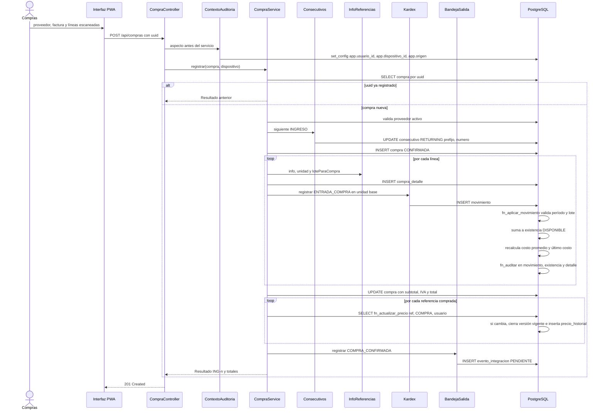
```mermaid
sequenceDiagram
    actor C as Compras
    participant UI as Interfaz PWA
    participant CC as CompraController
    participant CA as ContextoAuditoria
    participant CS as CompraService
    participant CO as Consecutivos
    participant IR as InfoReferencias
    participant K as Kardex
    participant BS as BandejaSalida
    participant DB as PostgreSQL
    C->>UI: proveedor, factura y líneas escaneadas
    UI->>CC: POST /api/compras con uuid
    CC->>CA: aspecto antes del servicio
    CA->>DB: set_config app.usuario_id, app.dispositivo_id, app.origen
    CC->>CS: registrar(compra, dispositivo)
    CS->>DB: SELECT compra por uuid
    alt uuid ya registrado
        CS-->>CC: Resultado anterior
    else compra nueva
        CS->>DB: valida proveedor activo
        CS->>CO: siguiente INGRESO
        CO->>DB: UPDATE consecutivo RETURNING prefijo, numero
        CS->>DB: INSERT compra CONFIRMADA
        loop por cada línea
            CS->>IR: info, unidad y loteParaCompra
            CS->>DB: INSERT compra_detalle
            CS->>K: registrar ENTRADA_COMPRA en unidad base
            K->>DB: INSERT movimiento
            DB->>DB: fn_aplicar_movimiento valida período y lote
            DB->>DB: suma a existencia DISPONIBLE
            DB->>DB: recalcula costo promedio y último costo
            DB->>DB: fn_auditar en movimiento, existencia y detalle
        end
        CS->>DB: UPDATE compra con subtotal, IVA y total
        loop por cada referencia comprada
            CS->>DB: SELECT fn_actualizar_precio ref, COMPRA, usuario
            DB->>DB: si cambia, cierra versión vigente e inserta precio_historial
        end
        CS->>BS: registrar COMPRA_CONFIRMADA
        BS->>DB: INSERT evento_integracion PENDIENTE
        CS-->>CC: Resultado ING-n y totales
    end
    CC-->>UI: 201 Created
```

### 6.3 Emitir venta

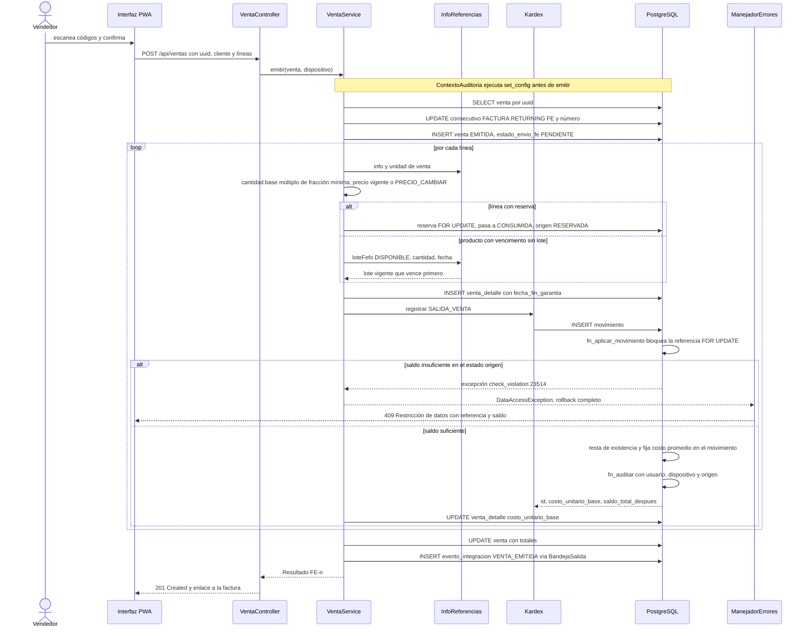
```mermaid
sequenceDiagram
    actor V as Vendedor
    participant UI as Interfaz PWA
    participant VC as VentaController
    participant VS as VentaService
    participant IR as InfoReferencias
    participant K as Kardex
    participant DB as PostgreSQL
    participant ME as ManejadorErrores
    V->>UI: escanea códigos y confirma
    UI->>VC: POST /api/ventas con uuid, cliente y líneas
    VC->>VS: emitir(venta, dispositivo)
    Note over VS,DB: ContextoAuditoria ejecuta set_config antes de emitir
    VS->>DB: SELECT venta por uuid
    VS->>DB: UPDATE consecutivo FACTURA RETURNING FE y número
    VS->>DB: INSERT venta EMITIDA, estado_envio_fe PENDIENTE
    loop por cada línea
        VS->>IR: info y unidad de venta
        VS->>VS: cantidad base múltiplo de fracción mínima, precio vigente o PRECIO_CAMBIAR
        alt línea con reserva
            VS->>DB: reserva FOR UPDATE, pasa a CONSUMIDA, origen RESERVADA
        else producto con vencimiento sin lote
            VS->>IR: loteFefo DISPONIBLE, cantidad, fecha
            IR-->>VS: lote vigente que vence primero
        end
        VS->>DB: INSERT venta_detalle con fecha_fin_garantia
        VS->>K: registrar SALIDA_VENTA
        K->>DB: INSERT movimiento
        DB->>DB: fn_aplicar_movimiento bloquea la referencia FOR UPDATE
        alt saldo insuficiente en el estado origen
            DB-->>VS: excepción check_violation 23514
            VS-->>ME: DataAccessException, rollback completo
            ME-->>UI: 409 Restricción de datos con referencia y saldo
        else saldo suficiente
            DB->>DB: resta de existencia y fija costo promedio en el movimiento
            DB->>DB: fn_auditar con usuario, dispositivo y origen
            DB-->>K: id, costo_unitario_base, saldo_total_despues
            VS->>DB: UPDATE venta_detalle costo_unitario_base
        end
    end
    VS->>DB: UPDATE venta con totales
    VS->>DB: INSERT evento_integracion VENTA_EMITIDA vía BandejaSalida
    VS-->>VC: Resultado FE-n
    VC-->>UI: 201 Created y enlace a la factura
```

### 6.4 Venta sin internet y sincronización

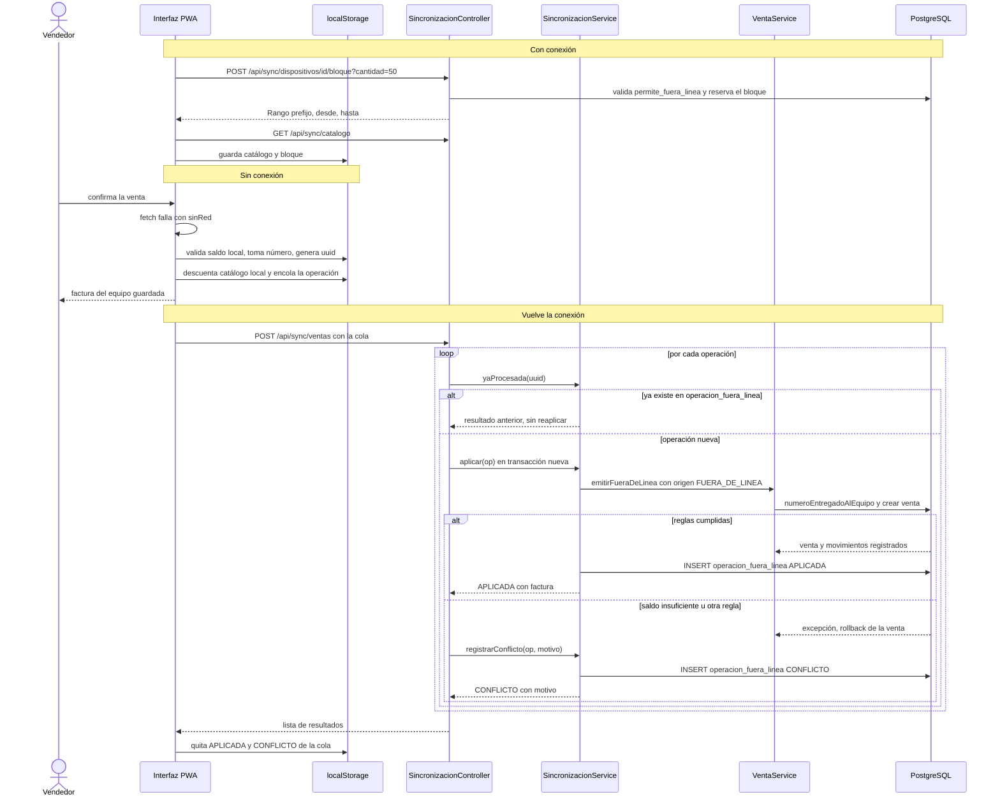
```mermaid
sequenceDiagram
    actor V as Vendedor
    participant UI as Interfaz PWA
    participant LS as localStorage
    participant SC as SincronizacionController
    participant SS as SincronizacionService
    participant VS as VentaService
    participant DB as PostgreSQL
    Note over UI,DB: Con conexión
    UI->>SC: POST /api/sync/dispositivos/id/bloque?cantidad=50
    SC->>DB: valida permite_fuera_linea y reserva el bloque
    SC-->>UI: Rango prefijo, desde, hasta
    UI->>SC: GET /api/sync/catalogo
    UI->>LS: guarda catálogo y bloque
    Note over UI,LS: Sin conexión
    V->>UI: confirma la venta
    UI->>UI: fetch falla con sinRed
    UI->>LS: valida saldo local, toma número, genera uuid
    UI->>LS: descuenta catálogo local y encola la operación
    UI-->>V: factura del equipo guardada
    Note over UI,DB: Vuelve la conexión
    UI->>SC: POST /api/sync/ventas con la cola
    loop por cada operación
        SC->>SS: yaProcesada(uuid)
        alt ya existe en operacion_fuera_linea
            SS-->>SC: resultado anterior, sin reaplicar
        else operación nueva
            SC->>SS: aplicar(op) en transacción nueva
            SS->>VS: emitirFueraDeLinea con origen FUERA_DE_LINEA
            VS->>DB: numeroEntregadoAlEquipo y crear venta
            alt reglas cumplidas
                DB-->>VS: venta y movimientos registrados
                SS->>DB: INSERT operacion_fuera_linea APLICADA
                SS-->>SC: APLICADA con factura
            else saldo insuficiente u otra regla
                DB-->>VS: excepción, rollback de la venta
                SC->>SS: registrarConflicto(op, motivo)
                SS->>DB: INSERT operacion_fuera_linea CONFLICTO
                SS-->>SC: CONFLICTO con motivo
            end
        end
    end
    SC-->>UI: lista de resultados
    UI->>LS: quita APLICADA y CONFLICTO de la cola
```

### 6.5 Cierre mensual programado

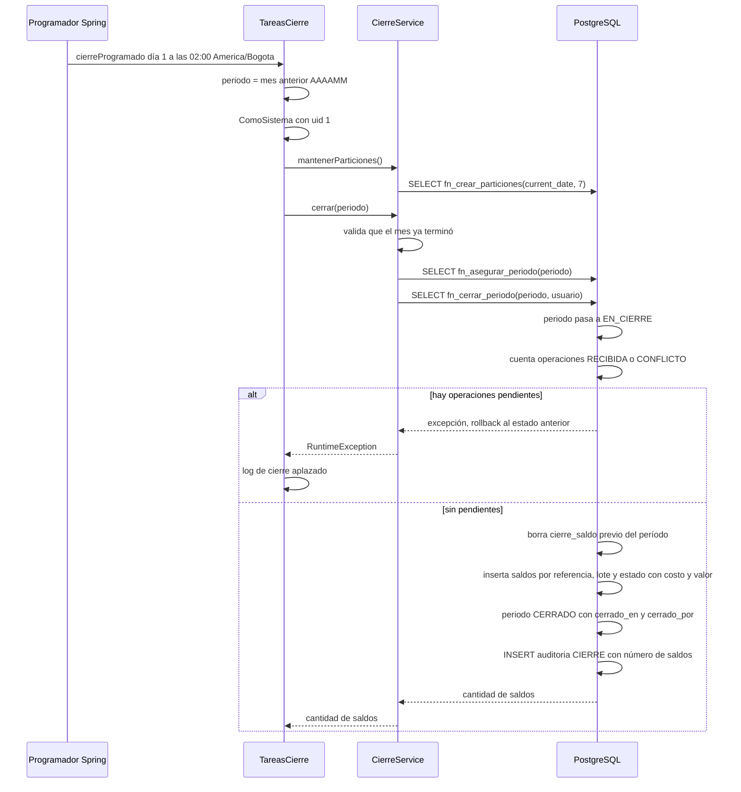
```mermaid
sequenceDiagram
    participant SCH as Programador Spring
    participant TC as TareasCierre
    participant CS as CierreService
    participant DB as PostgreSQL
    SCH->>TC: cierreProgramado día 1 a las 02:00 America/Bogota
    TC->>TC: periodo = mes anterior AAAAMM
    TC->>TC: ComoSistema con uid 1
    TC->>CS: mantenerParticiones()
    CS->>DB: SELECT fn_crear_particiones(current_date, 7)
    TC->>CS: cerrar(periodo)
    CS->>CS: valida que el mes ya terminó
    CS->>DB: SELECT fn_asegurar_periodo(periodo)
    CS->>DB: SELECT fn_cerrar_periodo(periodo, usuario)
    DB->>DB: periodo pasa a EN_CIERRE
    DB->>DB: cuenta operaciones RECIBIDA o CONFLICTO
    alt hay operaciones pendientes
        DB-->>CS: excepción, rollback al estado anterior
        CS-->>TC: RuntimeException
        TC->>TC: log de cierre aplazado
    else sin pendientes
        DB->>DB: borra cierre_saldo previo del período
        DB->>DB: inserta saldos por referencia, lote y estado con costo y valor
        DB->>DB: periodo CERRADO con cerrado_en y cerrado_por
        DB->>DB: INSERT auditoria CIERRE con número de saldos
        DB-->>CS: cantidad de saldos
        CS-->>TC: cantidad de saldos
    end
```

### 6.6 Migración desde Excel (validar y cargar)

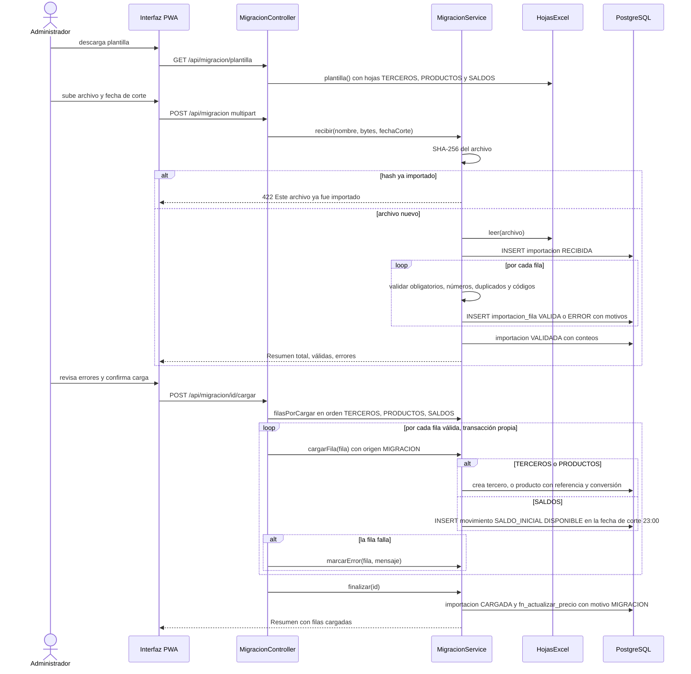
```mermaid
sequenceDiagram
    actor A as Administrador
    participant UI as Interfaz PWA
    participant MC as MigracionController
    participant MS as MigracionService
    participant HE as HojasExcel
    participant DB as PostgreSQL
    A->>UI: descarga plantilla
    UI->>MC: GET /api/migracion/plantilla
    MC->>HE: plantilla() con hojas TERCEROS, PRODUCTOS y SALDOS
    A->>UI: sube archivo y fecha de corte
    UI->>MC: POST /api/migracion multipart
    MC->>MS: recibir(nombre, bytes, fechaCorte)
    MS->>MS: SHA-256 del archivo
    alt hash ya importado
        MS-->>UI: 422 Este archivo ya fue importado
    else archivo nuevo
        MS->>HE: leer(archivo)
        MS->>DB: INSERT importacion RECIBIDA
        loop por cada fila
            MS->>MS: validar obligatorios, números, duplicados y códigos
            MS->>DB: INSERT importacion_fila VALIDA o ERROR con motivos
        end
        MS->>DB: importacion VALIDADA con conteos
        MS-->>UI: Resumen total, válidas, errores
    end
    A->>UI: revisa errores y confirma carga
    UI->>MC: POST /api/migracion/id/cargar
    MC->>MS: filasPorCargar en orden TERCEROS, PRODUCTOS, SALDOS
    loop por cada fila válida, transacción propia
        MC->>MS: cargarFila(fila) con origen MIGRACION
        alt TERCEROS o PRODUCTOS
            MS->>DB: crea tercero, o producto con referencia y conversión
        else SALDOS
            MS->>DB: INSERT movimiento SALDO_INICIAL DISPONIBLE en la fecha de corte 23:00
        end
        alt la fila falla
            MC->>MS: marcarError(fila, mensaje)
        end
    end
    MC->>MS: finalizar(id)
    MS->>DB: importacion CARGADA y fn_actualizar_precio con motivo MIGRACION
    MS-->>UI: Resumen con filas cargadas
```

---

## 7. Diagramas de estado

### 7.1 Venta y compra

La columna `estado` admite `BORRADOR`, pero el código crea los documentos ya confirmados en una sola transacción, por lo que ese estado no se usa.

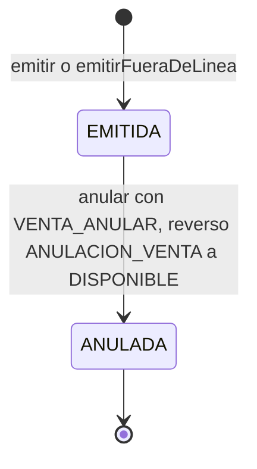
```mermaid
stateDiagram-v2
    [*] --> EMITIDA : emitir o emitirFueraDeLinea
    EMITIDA --> ANULADA : anular con VENTA_ANULAR, reverso ANULACION_VENTA a DISPONIBLE
    ANULADA --> [*]
```

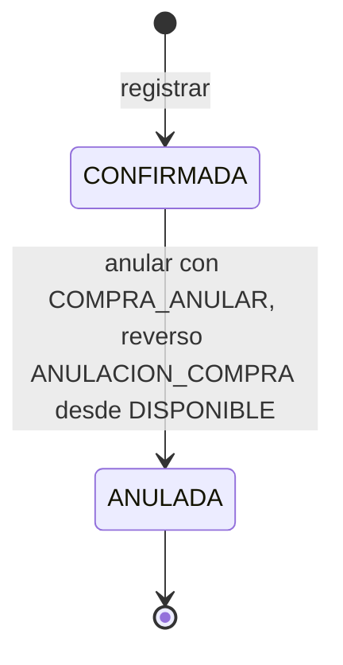
```mermaid
stateDiagram-v2
    [*] --> CONFIRMADA : registrar
    CONFIRMADA --> ANULADA : anular con COMPRA_ANULAR, reverso ANULACION_COMPRA desde DISPONIBLE
    ANULADA --> [*]
```

### 7.2 Reserva

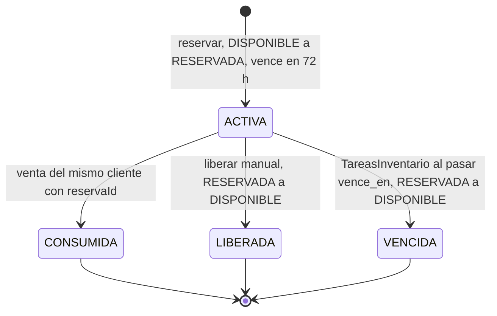
```mermaid
stateDiagram-v2
    [*] --> ACTIVA : reservar, DISPONIBLE a RESERVADA, vence en 72 h
    ACTIVA --> CONSUMIDA : venta del mismo cliente con reservaId
    ACTIVA --> LIBERADA : liberar manual, RESERVADA a DISPONIBLE
    ACTIVA --> VENCIDA : TareasInventario al pasar vence_en, RESERVADA a DISPONIBLE
    CONSUMIDA --> [*]
    LIBERADA --> [*]
    VENCIDA --> [*]
```

### 7.3 Período contable de inventario

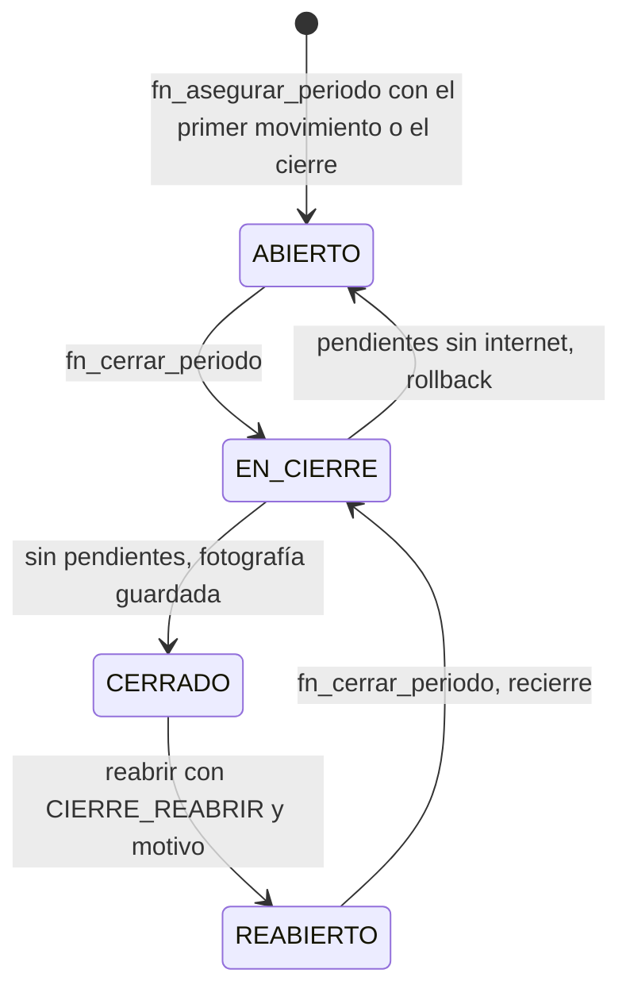
```mermaid
stateDiagram-v2
    [*] --> ABIERTO : fn_asegurar_periodo con el primer movimiento o el cierre
    ABIERTO --> EN_CIERRE : fn_cerrar_periodo
    REABIERTO --> EN_CIERRE : fn_cerrar_periodo, recierre
    EN_CIERRE --> CERRADO : sin pendientes, fotografía guardada
    EN_CIERRE --> ABIERTO : pendientes sin internet, rollback
    CERRADO --> REABIERTO : reabrir con CIERRE_REABRIR y motivo
```

`EN_CIERRE` solo existe dentro de la transacción del cierre; mientras dura, el disparador también rechaza movimientos de ese mes. Si el período estaba `REABIERTO`, el rollback lo devuelve a `REABIERTO`.

### 7.4 Operación fuera de línea

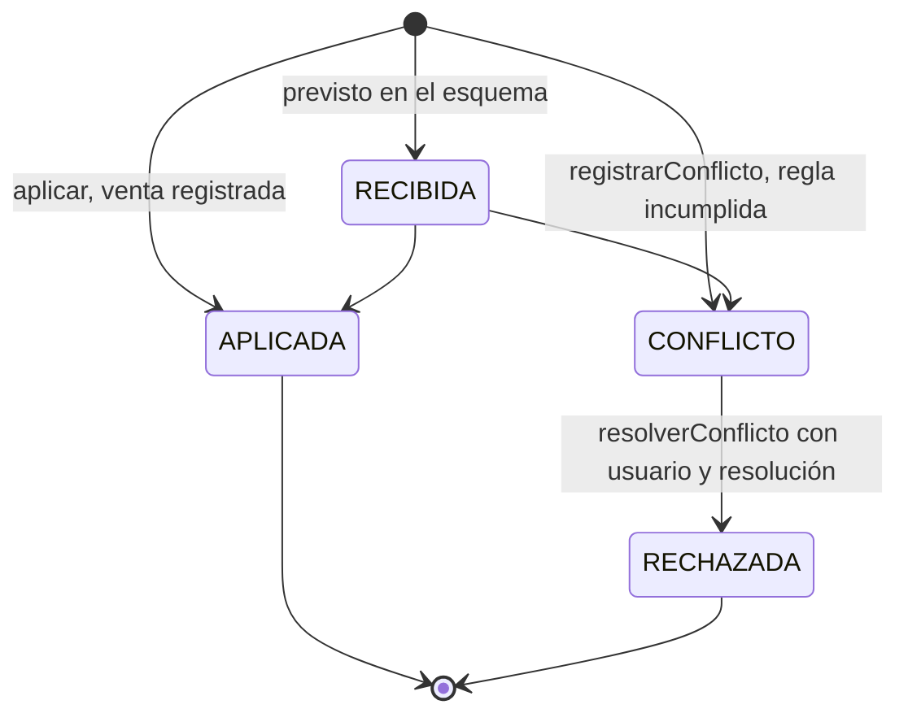
```mermaid
stateDiagram-v2
    [*] --> APLICADA : aplicar, venta registrada
    [*] --> CONFLICTO : registrarConflicto, regla incumplida
    [*] --> RECIBIDA : previsto en el esquema
    RECIBIDA --> APLICADA
    RECIBIDA --> CONFLICTO
    CONFLICTO --> RECHAZADA : resolverConflicto con usuario y resolución
    APLICADA --> [*]
    RECHAZADA --> [*]
```

El código inserta la operación directamente como `APLICADA` o `CONFLICTO`; `RECIBIDA` está en el esquema y lo cuenta `fn_cerrar_periodo`, pero hoy no se asigna.

### 7.5 Evento de integración

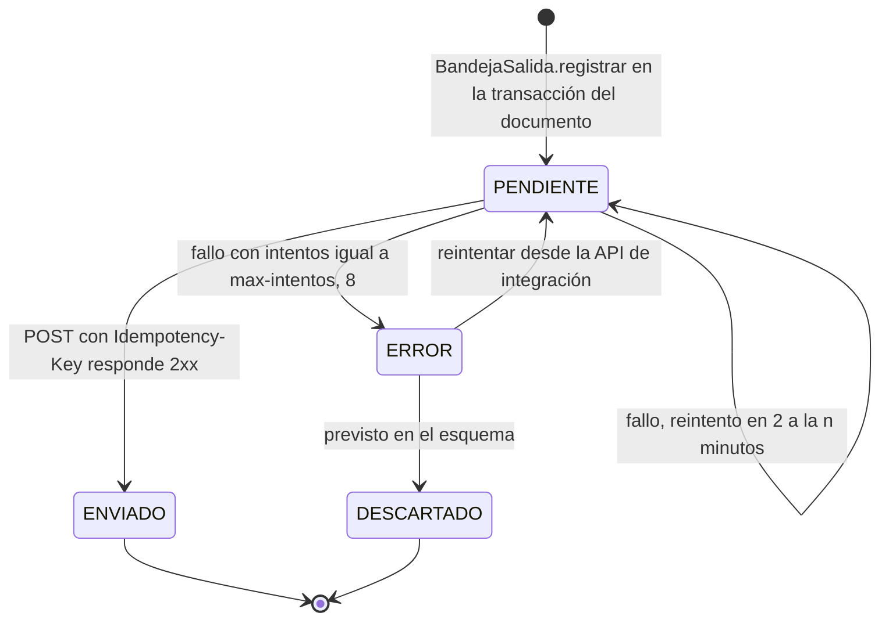
```mermaid
stateDiagram-v2
    [*] --> PENDIENTE : BandejaSalida.registrar en la transacción del documento
    PENDIENTE --> ENVIADO : POST con Idempotency-Key responde 2xx
    PENDIENTE --> PENDIENTE : fallo, reintento en 2 a la n minutos
    PENDIENTE --> ERROR : fallo con intentos igual a max-intentos, 8
    ERROR --> PENDIENTE : reintentar desde la API de integración
    ERROR --> DESCARTADO : previsto en el esquema
    ENVIADO --> [*]
    DESCARTADO --> [*]
```

### 7.6 Importación de Excel

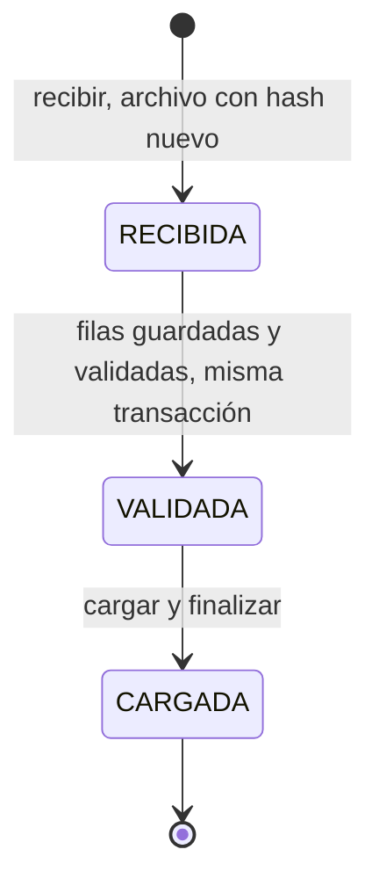
```mermaid
stateDiagram-v2
    [*] --> RECIBIDA : recibir, archivo con hash nuevo
    RECIBIDA --> VALIDADA : filas guardadas y validadas, misma transacción
    VALIDADA --> CARGADA : cargar y finalizar
    CARGADA --> [*]
```

El esquema también define `REVERTIDA` y `FALLIDA` para la importación, y `PENDIENTE` y `OMITIDA` para la fila, que el código actual no usa. Cada fila termina en `VALIDA`, `ERROR` o `CARGADA`.

### 7.7 Estados de las existencias

El pseudoestado inicial o final representa «fuera de la bodega». Entre paréntesis, el tipo de movimiento del kárdex.

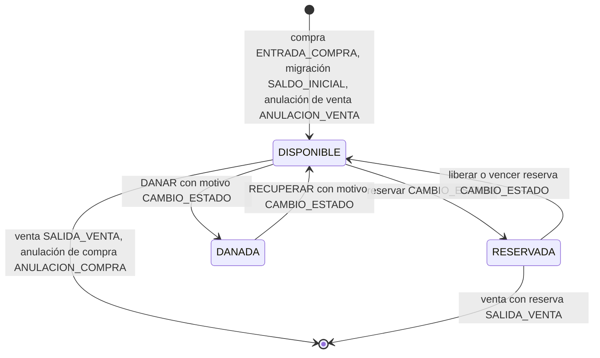
```mermaid
stateDiagram-v2
    [*] --> DISPONIBLE : compra ENTRADA_COMPRA, migración SALDO_INICIAL, anulación de venta ANULACION_VENTA
    DISPONIBLE --> [*] : venta SALIDA_VENTA, anulación de compra ANULACION_COMPRA
    DISPONIBLE --> RESERVADA : reservar CAMBIO_ESTADO
    RESERVADA --> DISPONIBLE : liberar o vencer reserva CAMBIO_ESTADO
    RESERVADA --> [*] : venta con reserva SALIDA_VENTA
    DISPONIBLE --> DANADA : DANAR con motivo CAMBIO_ESTADO
    DANADA --> DISPONIBLE : RECUPERAR con motivo CAMBIO_ESTADO
```

Lo dañado no sale de la bodega (RF-BAJ-001 está fuera del alcance) y no se vende (`ck_mov_no_vender_danado`). Ninguna transición puede dejar saldo negativo: el `UPDATE` del disparador exige `cantidad >= cantidad_base` y la tabla tiene `ck_existencia_no_negativa`.

---

## 8. Diseño de la API REST

API sin estado bajo `/api`, JSON, autenticación `Authorization: Bearer <JWT>`. La cabecera opcional `X-Dispositivo-Id` identifica el equipo para el kárdex y la auditoría. «Autenticado» significa que basta un token válido.

### 8.1 Endpoints

| Método | Ruta | Permiso | Descripción |
|---|---|---|---|
| POST | `/api/auth/login` | público | Valida credenciales y entrega el JWT con los permisos. |
| GET | `/api/usuarios` | `USUARIO_ADMINISTRAR` | Lista usuarios con sus roles. |
| GET | `/api/usuarios/roles` | `USUARIO_ADMINISTRAR` | Lista roles. |
| POST | `/api/usuarios` | `USUARIO_ADMINISTRAR` | Crea usuario (contraseña de 8 o más caracteres, bcrypt). |
| PUT | `/api/usuarios/{id}` | `USUARIO_ADMINISTRAR` | Cambia datos, roles, contraseña o lo activa o desactiva. |
| GET | `/api/catalogo/maestros` | autenticado | Categorías, marcas, unidades y tarifas de IVA. |
| GET | `/api/referencias` | autenticado | Busca por texto, categoría o bajo mínimo; costos solo con `COSTO_VER`. |
| GET | `/api/referencias/codigo/{codigo}` | autenticado | Busca por código de barras (lector). |
| GET | `/api/referencias/{id}` | autenticado | Detalle con unidades y lotes con saldo. |
| GET | `/api/lotes/por-vencer` | autenticado | Lotes con saldo que vencen en `dias` (60 por defecto). |
| POST | `/api/productos` | `PRODUCTO_EDITAR` | Crea producto con sus referencias. |
| POST | `/api/productos/{id}/referencias` | `PRODUCTO_EDITAR` | Agrega una referencia a un producto. |
| POST | `/api/referencias/{id}/conversiones` | `PRODUCTO_EDITAR` | Agrega unidad alterna con factor. |
| POST | `/api/categorias` | `PRODUCTO_EDITAR` | Crea categoría. |
| POST | `/api/marcas` | `PRODUCTO_EDITAR` | Crea marca. |
| PUT | `/api/referencias/{id}/precio/porcentaje` | `PRECIO_CAMBIAR` | Cambia el porcentaje y recalcula el precio. |
| PUT | `/api/referencias/{id}/precio/manual` | `PRECIO_CAMBIAR` | Fija un precio manual con motivo. |
| GET | `/api/referencias/{id}/precio/historial` | autenticado | Historial de precios; costo solo con `COSTO_VER`. |
| GET | `/api/terceros` | autenticado | Busca clientes o proveedores. |
| GET | `/api/terceros/{id}` | autenticado | Consulta un tercero. |
| POST | `/api/terceros` | `TERCERO_EDITAR` | Crea tercero (valida RN-13, RN-14 y DV del NIT). |
| PUT | `/api/terceros/{id}` | `TERCERO_EDITAR` | Actualiza tercero (la identificación no cambia). |
| POST | `/api/compras` | `COMPRA_REGISTRAR` | Registra y confirma la compra; idempotente por `uuid`. |
| POST | `/api/compras/{id}/anular` | `COMPRA_ANULAR` | Anula con reverso; exige motivo. |
| GET | `/api/compras` | `COMPRA_REGISTRAR` o `COSTO_VER` | Lista compras por fechas. |
| GET | `/api/compras/{id}` | `COMPRA_REGISTRAR` o `COSTO_VER` | Documento de ingreso con líneas. |
| POST | `/api/ventas` | `VENTA_EMITIR` | Emite la factura; idempotente por `uuid`. |
| POST | `/api/ventas/{id}/anular` | `VENTA_ANULAR` | Anula con reverso; exige motivo. |
| GET | `/api/ventas` | `VENTA_EMITIR` o `REPORTE_CONSULTAR` | Lista facturas por fechas. |
| GET | `/api/ventas/{id}` | autenticado | Factura completa para mostrar o imprimir. |
| POST | `/api/reservas` | `RESERVA_GESTIONAR` | Reserva para un cliente; idempotente por `uuid`. |
| POST | `/api/reservas/{id}/liberar` | `RESERVA_GESTIONAR` | Libera una reserva activa. |
| GET | `/api/reservas` | autenticado | Lista reservas por estado (`ACTIVA` por defecto). |
| POST | `/api/existencias/cambios-estado` | `ESTADO_DANADO` | `DANAR` o `RECUPERAR` existencias con motivo. |
| GET | `/api/kardex` | `PRODUCTO_EDITAR` o `REPORTE_CONSULTAR` | Movimientos con saldo y costo promedio después de cada uno. |
| GET | `/api/periodos` | autenticado | Períodos con estado, cierre y reapertura. |
| POST | `/api/periodos/{periodo}/cerrar` | `CIERRE_EJECUTAR` | Cierra un mes terminado. |
| POST | `/api/periodos/{periodo}/reabrir` | `CIERRE_REABRIR` | Reabre un mes cerrado con motivo. |
| GET | `/api/periodos/{periodo}/saldos` | `COSTO_VER` o `REPORTE_CONSULTAR` | Fotografía de saldos al cierre. |
| GET | `/api/reportes/ventas-diarias` | `REPORTE_CONSULTAR` | Facturas, base, IVA y total por día. |
| GET | `/api/reportes/margen` | `REPORTE_CONSULTAR` y `COSTO_VER` | Venta, costo y margen por referencia. |
| GET | `/api/reportes/valoracion` | `REPORTE_CONSULTAR` y `COSTO_VER` | Existencias por estado valoradas al costo promedio. |
| GET | `/api/reportes/garantias-vigentes` | `REPORTE_CONSULTAR` | Líneas de factura con garantía vigente. |
| GET | `/api/migracion/plantilla` | `MIGRACION_EJECUTAR` | Descarga la plantilla `.xlsx`. |
| POST | `/api/migracion` | `MIGRACION_EJECUTAR` | Sube el Excel y valida cada fila (no mueve inventario). |
| POST | `/api/migracion/{id}/cargar` | `MIGRACION_EJECUTAR` | Carga las filas válidas. |
| GET | `/api/migracion/{id}` | `MIGRACION_EJECUTAR` | Resumen y filas con errores. |
| GET | `/api/migracion` | `MIGRACION_EJECUTAR` | Lista importaciones. |
| GET | `/api/integracion/sistemas` | `USUARIO_ADMINISTRAR` | Lista sistemas externos. |
| POST | `/api/integracion/sistemas` | `USUARIO_ADMINISTRAR` | Crea o actualiza un sistema externo por código. |
| GET | `/api/integracion/eventos` | `USUARIO_ADMINISTRAR` | Lista eventos por estado. |
| POST | `/api/integracion/eventos/{id}/reintentar` | `USUARIO_ADMINISTRAR` | Pasa un evento `ERROR` a `PENDIENTE`. |
| GET | `/api/sync/catalogo` | autenticado | Catálogo con precios y existencias para la copia local. |
| GET | `/api/sync/dispositivos` | autenticado | Equipos activos. |
| POST | `/api/sync/dispositivos/{id}/bloque` | `VENTA_EMITIR` | Entrega un bloque de números de factura (1 a 500). |
| POST | `/api/sync/ventas` | `VENTA_EMITIR` | Sincroniza ventas hechas sin internet. |
| GET | `/api/sync/conflictos` | `PRODUCTO_EDITAR` o `VENTA_ANULAR` | Operaciones en conflicto. |
| POST | `/api/sync/conflictos/{uuid}/resolver` | `PRODUCTO_EDITAR` o `VENTA_ANULAR` | Resuelve un conflicto (queda `RECHAZADA`). |
| GET | `/api/auditoria` | `AUDITORIA_CONSULTAR` | Eventos con antes y después, filtrados. |

### 8.2 Contrato de errores

`ManejadorErrores` responde con `ProblemDetail` (RFC 7807): `status`, `title` y `detail` con el mensaje para el usuario. La interfaz (`api.js`) muestra `detail`.

| Código | `title` | Cuándo ocurre |
|---|---|---|
| 400 | Datos inválidos | Falla la validación de Bean Validation del cuerpo (`MethodArgumentNotValidException`); `detail` lista campo y mensaje. |
| 401 | — | Sin token, token vencido o con firma inválida (Spring Security), o credenciales erradas en el login. La interfaz cierra la sesión. |
| 403 | Acceso denegado | El usuario no tiene el permiso del `@PreAuthorize` («No tiene permiso para esta operación»). |
| 404 | No encontrado | `NoEncontradoException`: compra, venta, reserva, referencia, tercero, cliente o importación inexistente. |
| 409 | Registro duplicado | PostgreSQL `23505`: código de barras, identificación de tercero o factura de proveedor repetidos. |
| 409 | Restricción de datos | PostgreSQL `23514`, `23503`, `23502`: saldo insuficiente (`check_violation` lanzado por `fn_aplicar_movimiento`), `CHECK` del esquema, llave foránea o nulo. |
| 422 | Regla de negocio | `NegocioException` del servicio, o `P0001` (`RAISE EXCEPTION` de un disparador): período cerrado, lote vencido, producto con vencimiento sin lote, período no abierto. |
| 500 | Error de base de datos | Cualquier otro error de datos; se registra en el log y se responde «Error interno». |

---

## 9. Diseño de la interfaz

Aplicación de una sola página en React (`frontend/src/App.jsx`) con enrutador por `#/ruta`; cada pantalla es un componente de `frontend/src/paginas/`. El menú (`MENU` en `App.jsx`) solo muestra las opciones para las que el usuario tiene al menos uno de los permisos indicados; la autorización real la hace la API.

| Pantalla (ruta) | Permisos que la muestran | Rol típico | Propósito |
|---|---|---|---|
| Iniciar sesión (`login`) | — | Todos | Usuario y contraseña; guarda la sesión JWT. |
| Inicio (`inicio`) | todos | Todos | Referencias bajo stock mínimo, lotes que vencen en 90 días y ventas del día (con `REPORTE_CONSULTAR`). |
| Vender (`vender`) | `VENTA_EMITIR` | Vendedor | Punto de venta con lector: cliente, forma de pago, líneas con unidad y cantidad, total con IVA; cae a modo sin internet. |
| Facturas (`ventas`, `factura/{id}`) | `VENTA_EMITIR`, `REPORTE_CONSULTAR` | Vendedor, Gerencia | Lista por fechas, factura para imprimir y anulación con motivo. |
| Comprar (`comprar`) | `COMPRA_REGISTRAR` | Compras | Proveedor, factura del proveedor, líneas por código con costo y lote. |
| Compras registradas (`compras`) | `COMPRA_REGISTRAR`, `COSTO_VER` | Compras, Gerencia | Ingresos por fechas; detalle en ventana y anulación con motivo (`COMPRA_ANULAR`). |
| Productos y existencias (`productos`) | todos | Todos; edición Inventario | Búsqueda; al tocar un producto, ventana emergente con existencias, unidades (y alta de unidades), lotes, historial de precios, cambio de porcentaje y precio manual; botón «Nuevo producto» que abre el alta en otra ventana, con creación rápida de categoría y marca. |
| Clientes y proveedores (`terceros`) | todos | Vendedor, Compras | Búsqueda; alta y edición de terceros en ventana emergente. |
| Reservas y dañados (`reservas`) | `RESERVA_GESTIONAR`, `ESTADO_DANADO` | Vendedor, Inventario | Reservas activas, nueva reserva, liberación y paso a dañado o recuperado. |
| Kárdex (`kardex`) | `PRODUCTO_EDITAR`, `REPORTE_CONSULTAR` | Inventario, Gerencia | Movimientos por código y fechas con saldo y costo después de cada uno. |
| Cierres mensuales (`cierres`) | todos | Inventario, Gerencia | Períodos, cierre manual, reapertura con motivo y saldos al cierre. |
| Reportes (`reportes`) | `REPORTE_CONSULTAR` | Gerencia, Inventario | Ventas diarias y garantías; margen y valoración con `COSTO_VER`. |
| Migración Excel (`migracion`) | `MIGRACION_EJECUTAR` | Administrador | Plantilla, carga con fecha de corte, revisión de errores y carga de filas válidas. |
| Auditoría (`auditoria`) | `AUDITORIA_CONSULTAR` | Gerencia | Filtro por fechas, usuario, tabla y acción, con antes y después. |
| Usuarios (`usuarios`) | `USUARIO_ADMINISTRAR` | Administrador | Alta y edición en ventana (roles, correo, nueva contraseña), activación y desactivación. |
| Integraciones (`integraciones`) | `USUARIO_ADMINISTRAR` | Administrador | Sistemas externos y eventos enviados, con reintento de los que fallaron. |
| Sin internet (`offline`) | `VENTA_EMITIR` | Vendedor; conflictos para Inventario y Gerencia | Elegir equipo, pedir bloque de 50 números, actualizar catálogo local, sincronizar y ver ventas pendientes y conflictos. |

**Comportamiento PWA sin conexión.** `manifest.webmanifest` permite instalar la aplicación; el *service worker* (`sw.js`) guarda la interfaz con estrategia «red primero, caché si falla» y **nunca** guarda respuestas de `/api/`. Los datos para trabajar sin internet viven en `localStorage` (`offline.js`): catálogo, equipo, bloque de facturas y cola de ventas. La barra superior muestra «En línea» o «Sin internet» y el número de ventas por sincronizar; la sincronización se intenta al recuperar la red y cada 60 segundos. El lector de códigos funciona como teclado: el código seguido de Enter dispara la búsqueda, también contra la copia local.

---

## 10. Principios de diseño aplicados

1. **Las reglas críticas viven en la base de datos.** Saldos no negativos, período cerrado, lote obligatorio y no vencido, costo promedio ponderado, versionado de precios, cierre y auditoría están en disparadores y funciones (`fn_aplicar_movimiento`, `fn_actualizar_precio`, `fn_cerrar_periodo`, `fn_auditar`) y en restricciones `CHECK` y `UNIQUE`. Java valida antes para dar mensajes claros, pero ningún camino (API, sincronización, migración o SQL directo) puede saltarse las reglas. `fn_aplicar_movimiento` bloquea la referencia con `FOR UPDATE` para serializar ventas concurrentes del mismo producto.
2. **Idempotencia por `uuid`.** Compra, venta, reserva y operación sin internet llevan un `uuid` generado por el cliente con restricción `UNIQUE`; un reintento devuelve el resultado anterior. Los eventos de integración viajan con `Idempotency-Key` y la migración rechaza un archivo con el mismo SHA-256.
3. **Kárdex inmutable.** `movimiento` y `auditoria` solo admiten inserción (`fn_inmutable`); una anulación es un movimiento de reverso (`ANULACION_COMPRA`, `ANULACION_VENTA`) enlazado por `reversa_movimiento_id`. Ambas tablas se particionan por mes y las particiones se crean por adelantado (RNF-MAN-001).
4. **Atomicidad y outbox.** Cada documento con sus líneas, movimientos y evento de integración se guarda en una sola transacción; si algo falla no queda nada a medias, y el envío al sistema externo ocurre después sin bloquear la venta.
5. **Auditoría con contexto.** El aspecto `ContextoAuditoria` fija usuario, equipo y origen (`EN_LINEA`, `FUERA_DE_LINEA`, `MIGRACION`, `INTEGRACION`) con `set_config` local a la transacción, y el disparador los registra junto a los valores antes y después.
6. **Módulos por negocio.** Paquetes `catalogo`, `terceros`, `compras`, `ventas`, `inventario`, `precios`, `cierres`, `sincronizacion`, `integracion`, `migracion`, `reportes`, `auditoria`, `seguridad` y `comun`, cada uno con controlador delgado y servicio transaccional; el vocabulario del código es el del negocio.
7. **Permisos, no roles, en el código.** Todo endpoint que modifica datos o expone información sensible declara un permiso con `@PreAuthorize` (las consultas de catálogo solo exigen sesión y ocultan costos sin `COSTO_VER`); los roles solo agrupan permisos en la base de datos, de modo que cambiar la matriz no exige cambiar código.

---

## 11. Diferencias conocidas entre el código y los requisitos

Se registran para que el equipo decida si se implementan o se ajusta el requisito:

| Requisito | Situación en el código |
|---|---|
| RF-OFF-001 (operaciones sin internet) | Solo se sincronizan **ventas**; compra, reserva y registro de cliente sin conexión no tienen endpoint, aunque `tipo_operacion` los admite. El `uuid` lo genera `crypto.randomUUID` (v4), no UUID v7. |
| RF-OFF-001 (conflictos) | La resolución solo deja la operación `RECHAZADA`; no hay opción de reaplicarla. La pantalla «Sin internet» lista los conflictos con un botón «Resolver» que registra la resolución. |
| RF-CIE-001 (aviso al aplazar) | El cierre aplazado solo queda en el registro de la aplicación; no se avisa al responsable. |
| RF-INT-001 | No hay entrada de datos desde sistemas externos (`direccion = 'ENTRADA'`, `mapeo_externo` sin uso) ni aviso al administrador; el estado `DESCARTADO` no se asigna. |
| RF-REP-001 | No hay exportación a Excel o PDF (solo impresión de la factura) ni reportes de compras por período o lotes por vencer dentro de «Reportes» (los lotes están en Inicio). |
| RF-MOV-003 | El kárdex filtra por referencia y fechas, no por tipo de movimiento ni documento. |
| Administración de equipos | No hay endpoint para registrar dispositivos ni rangos de facturación por equipo; se cargan por SQL. |
| Estados sin uso | `BORRADOR` (compra y venta), `RECIBIDA` (operación sin internet), `REVERTIDA` y `FALLIDA` (importación), `PENDIENTE` y `OMITIDA` (fila de importación). |
| Errores de saldo | Para productos con vencimiento sin lote indicado, la falta de saldo se detecta en `loteFefo` y responde 422 en lugar de 409. |
